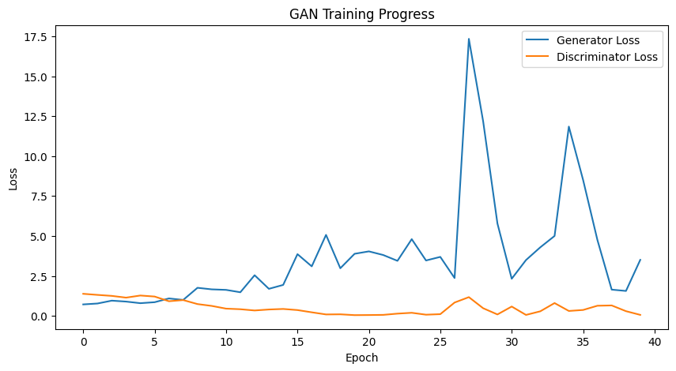

# Deep Convolutional Generative Adversarial Network (DCGAN)

## Overview

This repository implements a **Deep Convolutional Generative Adversarial Network (DCGAN)** as described in the paper ["Unsupervised Representation Learning with Deep Convolutional Generative Adversarial Networks"](https://arxiv.org/abs/1511.06434) by Radford et al. (2015). The goal is to train a model to generate realistic 64x64 pixel images using the LSUN Bedrooms dataset.


## What is a GAN?

A **Generative Adversarial Network (GAN)** consists of two neural networks trained simultaneously:

- **Generator (G)**: Takes random noise as input and generates fake data samples
- **Discriminator (D)**: Takes both real and fake data samples and tries to distinguish between them

This adversarial process is formalized as a minimax game:


## DCGAN Architecture

This implementation follows these architectural guidelines:

- **Convolutional Layers** instead of fully connected layers
- **Fractionally-Strided Convolutions** for upsampling in the Generator
- **Batch Normalization** in both networks to stabilize training
- **LeakyReLU Activation** to prevent vanishing gradients
- **No Pooling Layers** - strided convolutions for downsampling/upsampling

### Generator Architecture
- Input: 100-dimensional noise vector
- Project and reshape to 8×8×512
- Four transposed convolutional layers with batch normalization
- Output: 64×64×3 RGB image with tanh activation

### Discriminator Architecture
- Input: 64×64×3 image
- Four convolutional layers with LeakyReLU and dropout
- Output: Single value probability (real or fake)

## Training Process

The training process involves:

1. **Discriminator Training**:
   - Sample real images from the dataset
   - Generate fake images using the Generator
   - Train Discriminator to classify real vs. fake

2. **Generator Training**:
   - Generate fake images
   - Train Generator to fool the Discriminator

## Requirements

```
tensorflow>=2.4.0
matplotlib
numpy
tqdm
```

## Usage

1. Clone the repository:
```bash
git clone https://github.com/yourusername/dcgan.git
cd dcgan
```

2. Install dependencies:
```bash
pip install -r requirements.txt
```

3. Run the training script:
```bash
python dcgan.py
```

## Code

The implementation includes:

```python
import os
import glob
import tensorflow as tf
from tensorflow.keras import layers
import matplotlib.pyplot as plt
import numpy as np
from tqdm import tqdm
import time

# Setup parameters
BATCH_SIZE = 64
IMG_SIZE = 64
NOISE_DIM = 100
EPOCHS = 1000
CHECKPOINT_DIR = './training_checkpoints'
OUTPUT_DIR = './generated_images'

# Create directories if they don't exist
os.makedirs(CHECKPOINT_DIR, exist_ok=True)
os.makedirs(OUTPUT_DIR, exist_ok=True)

# Generator
def build_generator():
    model = tf.keras.Sequential()

    # First layer using Input
    model.add(layers.Input(shape=(NOISE_DIM,)))
    model.add(layers.Dense(8 * 8 * 512, use_bias=False))
    model.add(layers.BatchNormalization())
    model.add(layers.LeakyReLU(0.2))
    model.add(layers.Reshape((8, 8, 512)))

    model.add(layers.Conv2DTranspose(256, 5, strides=2, padding='same', use_bias=False))
    model.add(layers.BatchNormalization())
    model.add(layers.LeakyReLU(0.2))

    model.add(layers.Conv2DTranspose(128, 5, strides=2, padding='same', use_bias=False))
    model.add(layers.BatchNormalization())
    model.add(layers.LeakyReLU(0.2))

    model.add(layers.Conv2DTranspose(64, 5, strides=2, padding='same', use_bias=False))
    model.add(layers.BatchNormalization())
    model.add(layers.LeakyReLU(0.2))

    model.add(layers.Conv2DTranspose(3, 5, strides=1, padding='same', activation='tanh'))

    return model

# Discriminator
def build_discriminator():
    model = tf.keras.Sequential()

    # First layer using Input
    model.add(layers.Input(shape=(IMG_SIZE, IMG_SIZE, 3)))
    model.add(layers.Conv2D(64, 5, strides=2, padding='same'))
    model.add(layers.LeakyReLU(0.2))
    model.add(layers.Dropout(0.3))

    model.add(layers.Conv2D(128, 5, strides=2, padding='same'))
    model.add(layers.LeakyReLU(0.2))
    model.add(layers.Dropout(0.3))

    model.add(layers.Conv2D(256, 5, strides=2, padding='same'))
    model.add(layers.LeakyReLU(0.2))
    model.add(layers.Dropout(0.3))

    model.add(layers.Flatten())
    model.add(layers.Dense(1))  # No activation for WGAN-like loss

    return model

# Loss functions
cross_entropy = tf.keras.losses.BinaryCrossentropy(from_logits=True)

def generator_loss(fake_output):
    return cross_entropy(tf.ones_like(fake_output), fake_output)

def discriminator_loss(real_output, fake_output):
    real_loss = cross_entropy(tf.ones_like(real_output), real_output)
    fake_loss = cross_entropy(tf.zeros_like(fake_output), fake_output)
    return real_loss + fake_loss

# Training step
@tf.function
def train_step(real_images):
    # Handle batch size issues
    batch_size = tf.shape(real_images)[0]
    noise = tf.random.normal([batch_size, NOISE_DIM])

    with tf.GradientTape() as gen_tape, tf.GradientTape() as disc_tape:
        # Generate fake images
        generated_images = generator(noise, training=True)

        # Get discriminator outputs
        real_output = discriminator(real_images, training=True)
        fake_output = discriminator(generated_images, training=True)

        # Calculate losses
        gen_loss = generator_loss(fake_output)
        disc_loss = discriminator_loss(real_output, fake_output)

    # Calculate gradients
    gen_gradients = gen_tape.gradient(gen_loss, generator.trainable_variables)
    disc_gradients = disc_tape.gradient(disc_loss, discriminator.trainable_variables)

    # Apply gradients
    gen_optimizer.apply_gradients(zip(gen_gradients, generator.trainable_variables))
    disc_optimizer.apply_gradients(zip(disc_gradients, discriminator.trainable_variables))

    return gen_loss, disc_loss
```

## Results

The training progress can be visualized through:

1. **Loss Curves**: Showing the Generator and Discriminator losses over time



2. **Generated Images**: Samples produced by the Generator at different training stages

## Credits

Implemented by: Varad Lad (22070126057)

## References

1. Radford, A., Metz, L., & Chintala, S. (2015). Unsupervised representation learning with deep convolutional generative adversarial networks. arXiv preprint arXiv:1511.06434.
2. Goodfellow, I., Pouget-Abadie, J., Mirza, M., Xu, B., Warde-Farley, D., Ozair, S., ... & Bengio, Y. (2014). Generative adversarial nets. Advances in neural information processing systems, 27.
